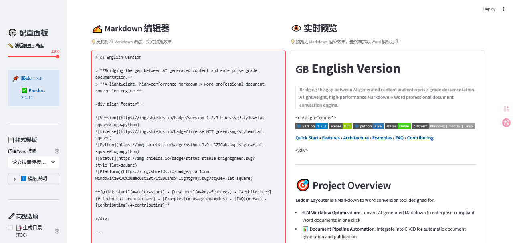

# 📝 Ledom Layouter (v1.3.0)


[中文](#-中文版本) | [English](#-english-version)


---

# 🇨🇳 中文版本

> **从 AI 智能输出到专业文档规范的最后一公里。**  
> **一款轻量级、高效能的 Markdown → Word 专业文档转换引擎。**


**[快速开始](#-快速开始) • [核心特性](#-核心特性) • [技术架构](#-技术架构) • [使用示例](#-使用示例) • [常见问题](#-常见问题-faq) • [贡献指南](#-贡献指南)**



---

## 🎯 项目定位

**Ledom Layouter** 是一款专为以下场景设计的 Markdown 转 Word 转换工具：

- 🤖 **AI 工作流优化**：将大模型生成的 Markdown 一键转换为符合企业规范的 Word 文档
- 📊 **文档管线自动化**：集成到 CI/CD 流程，实现文档的自动生成与发布
- 🎨 **样式一致性保障**：通过自定义模板机制，确保组织级文档的统一视觉规范
- 🔒 **本地私密处理**：100% 本地化处理，零数据外泄风险，适合涉密文档

### 为什么选择 Ledom Layouter？

| 维度 | 传统在线方案 | Ledom Layouter |
|------|---------|---|
| **转换引擎** | 在线 API（隐私风险） | 本地 Pandoc（完全私密） |
| **样式管控** | 手动调整（费时耗力） | 模板映射（一致高效） |
| **集成难度** | 复杂配置（学习陡峭） | 开箱即用（即插即用） |
| **部署成本** | 云端订阅（持续付费） | 开源免费（永久所有） |
| **更新频率** | 等待厂商更新 | 自主定制升级 |

---

## ✨ 核心特性

### 🎨 **企业级样式映射**

基于 Pandoc 的 `--reference-doc` 机制，实现 **Markdown 结构 → Word 样式** 的精准映射。无需手动调整格式，一次定义，永久复用。

```
Markdown 层级结构              Word 模板样式
┌─────────────────────────────────────────┐
│  # H1           ──────────►  标题1样式   │
│  ## H2          ──────────►  标题2样式   │
│  ### H3         ──────────►  标题3样式   │
│  正文           ──────────►  正文样式    │
└─────────────────────────────────────────┘
```

### 📋 **AI 友好的交互设计**

- ⚡ **一键读取剪贴板**：无缝适配大模型 API 输出流程
- 🔄 **实时双窗格预览**：编辑器与预览框像素级对齐（IDE 体验）
- 📊 **即时统计反馈**：字数、行数、词汇实时计算
- 🎯 **快速模板切换**：秒级切换企业级模板

### 🔐 **安全 & 隐私**

- 🛡️ 100% 本地处理，无网络请求
- 🔒 临时文件自动清理（`try...finally` 确保零泄漏）
- 📁 支持自定义模板库，组织级数据管控
- ✅ 开源透明，代码完全可审计

### 📈 **高性能 UI 优化**

- ⚡ 使用 `@st.fragment` 实现部分渲染，避免全页刷新
- 🎭 CSS 视觉纠偏补丁，确保编辑区与预览区完美对齐
- 🚀 秒级响应，适合高频迭代场景
- 💾 支持本地缓存，加速重复转换

### 🎁 **开箱即用**

- 📚 内置 Markdown 语法速查表
- 📖 完整的模板制作教程
- 🧪 提供演示文档（含代码块、表格、公式）
- 📜 转换历史记录

---

## 🚀 快速开始

### 📋 前置要求

| 组件 | 版本 | 用途 |
|------|------|------|
| **Python** | 3.9+ | 运行环境 |
| **Pandoc** | 2.19+ | 文档转换核心 |
| **pip** | 最新 | 包管理工具 |

### 1️⃣ 安装 Pandoc

**Windows** (使用 WinGet)
```bash
winget install pandoc
```

**macOS** (使用 Homebrew)
```bash
brew install pandoc
```

**Linux** (使用 apt)
```bash
sudo apt-get update
sudo apt-get install pandoc
```

验证安装：
```bash
pandoc --version
```

### 2️⃣ 克隆与安装

```bash
# 克隆仓库
git clone https://github.com/liuwei71320/ledom-layouter.git
cd ledom-layouter

# 创建虚拟环境（推荐）
python -m venv venv
source venv/bin/activate  # macOS/Linux
# 或
venv\Scripts\activate  # Windows

# 安装依赖
pip install streamlit pypandoc pyperclip
```

### 3️⃣ 启动应用

```bash
streamlit run app.py
```

🎉 应用将在 `http://localhost:8501` 自动打开！

---

## 📖 使用示例

### 场景 1：AI 生成文档快速转换

```
1. 从 ChatGPT/Claude 复制 Markdown 输出
2. 点击"📋 读取剪贴板"按钮
3. 在侧边栏选择企业模板
4. 点击"🚀 导出 Word"
5. 下载到本地，立即分享
⏱️ 全流程 < 30 秒
```

### 场景 2：批量文档转换管线

```python
# 示例：集成到 Python 脚本
import pypandoc
from pathlib import Path

# 扫描 markdown 文件夹
for md_file in Path("docs/").glob("*.md"):
    with open(md_file, "r", encoding="utf-8") as f:
        content = f.read()
    
    # 使用企业模板转换
    pypandoc.convert_text(
        content,
        "docx",
        format="md",
        outputfile=f"output/{md_file.stem}.docx",
        extra_args=["--reference-doc=templates/企业标准模板.docx"]
    )
```

### 场景 3：自定义企业模板

**步骤：**
1. 在 Word 中创建标准文档
2. 定义标题 1-6、正文、代码块等样式
3. 保存为 `.docx` → 放入 `templates/` 文件夹
4. 刷新应用，即可在侧边栏选择

**推荐样式设置：**
```
标题1  → 华文中宋, 24pt, 蓝色, 段前18pt, 段后6pt
标题2  → 仿宋, 18pt, 深灰色, 段前12pt, 段后3pt
标题3  → 仿宋, 14pt, 黑色, 段前6pt, 段后3pt
正文   → Calibri, 11pt, 黑色, 行距 1.5
代码块 → Courier New, 10pt, 浅灰背景
```

---

## 🛠️ 技术架构

### 系统组件图

```
┌──────────────────────────────────────────────────────────────┐
│                     Ledom Layouter v1.2.3                     │
├──────────────────────────────────────────────────────────────┤
│                                                                │
│  ┌─────────────┐     ┌──────────────┐     ┌──────────────┐   │
│  │   Streamlit │────▶│  Editor UI   │────▶│ Preview MD   │   │
│  │  (Frontend) │     │  + Preview   │     │  Renderer    │   │
│  └─────────────┘     └──────────────┘     └──────────────┘   │
│         │                                                      │
│         │ (Markdown Text)                                      │
│         ▼                                                      │
│  ┌──────────────────────────────────┐                         │
│  │   Conversion Engine              │                         │
│  │  ┌──────────────────────────────┐│                         │
│  │  │  Pandoc Wrapper              ││                         │
│  │  │  + Reference Doc Mapper      ││                         │
│  │  │  + TOC Generator             ││                         │
│  │  │  + Section Numbering         ││                         │
│  │  └──────────────────────────────┘│                         │
│  └──────────────────────────────────┘                         │
│         │                                                      │
│         │ (.docx)                                              │
│         ▼                                                      │
│  ┌──────────────────────────────────┐                         │
│  │   Output Pipeline                │                         │
│  │  ┌──────────────────────────────┐│                         │
│  │  │  Temp File Management        ││                         │
│  │  │  + Safe Cleanup              ││                         │
│  │  │  + Download Handler          ││                         │
│  │  └──────────────────────────────┘│                         │
│  └──────────────────────────────────┘                         │
└──────────────────────────────────────────────────────────────┘
```

### 技术栈

| 层级 | 技术 | 职能 |
|------|------|------|
| **UI 层** | Streamlit 1.28+ | 响应式 Web 前端 |
| **逻辑层** | Python 3.9+ | 业务逻辑与事件处理 |
| **转换层** | Pandoc 2.19+ | 高保真文档转换引擎 |
| **I/O 层** | `tempfile` + `pathlib` | 安全的文件操作 |
| **集成层** | `pyperclip` | 跨平台剪贴板集成 |

### 关键设计模式

#### 1️⃣ **Reference Doc 映射机制**
```python
def safe_convert(text, output_path, template_path, add_toc=False):
    """通过 Pandoc 的 --reference-doc 实现样式映射"""
    p_args = [f'--reference-doc={template_path}']
    if add_toc:
        p_args.append('--toc')
    
    pypandoc.convert_text(text, 'docx', format='md',
                         outputfile=output_path,
                         extra_args=p_args)
```

#### 2️⃣ **Fragment 局部渲染优化**
```python
@st.fragment
def render_editor():
    # 部分组件重渲染，不影响全局状态
    col_edit, col_preview = st.columns(2)
    # ... 编辑器和预览逻辑
```

#### 3️⃣ **文件生命周期安全管理**
```python
try:
    with tempfile.NamedTemporaryFile(suffix=".docx", delete=False) as tmp:
        safe_convert(content, tmp.name, template)
        with open(tmp.name, "rb") as f:
            file_data = f.read()
finally:
    os.unlink(tmp.name)  # 确保文件清理
```

---

## 📁 项目结构

```
ledom-layouter/
├── app.py                          # 主应用入口
├── requirements.txt                # Python 依赖
├── templates/                      # 自定义 Word 模板库
│   ├── 企业标准模板.docx
│   ├── 技术规格书模板.docx
│   └── 提案书模板.docx
├── README.md                       # 项目文档（中英双语）
├── LICENSE                         # MIT 开源协议
├── .gitignore                      # Git 忽略配置
└── CHANGELOG.md                    # 版本变更记录
```

---

## 🎓 常见问题 (FAQ)

### ❓ Q1: 为什么预览和最终输出的样式不一致？

**A:** Streamlit 预览使用的是 Markdown 渲染，最终 Word 文档样式由您选择的模板决定。这是正常的！建议：
- 在模板中设置字体、颜色、间距
- 预览仅用于内容检查，不代表最终样式
- 可以在 Word 中打开模板进行高级调整

### ❓ Q2: 可以转换其他格式（如 PDF、HTML）吗？

**A:** 当前版本专注 Word 转换。但由于使用 Pandoc 引擎，理论上支持多种格式。可修改代码实现：
```python
# 修改这行：
pypandoc.convert_text(text, 'pdf', ...)   # 改为 'pdf'
pypandoc.convert_text(text, 'html', ...) # 改为 'html'
```

### ❓ Q3: 支持表格、公式、代码块吗？

**A:** ✅ 完全支持！示例：

**Markdown 表格**
```markdown
| 功能 | 支持 |
|------|------|
| 表格 | ✅ |
| 代码块 | ✅ |
| 公式 | ✅ |
```

**LaTeX 公式**
```markdown
当 $a \ne 0$ 时，$x = \frac{-b \pm \sqrt{b^2-4ac}}{2a}$
```

**代码块**
~~~markdown
```python
def hello():
    print("Ledom Layouter")
```
~~~

### ❓ Q4: 如何在生产环境中使用？

**A:** 可部署到 Streamlit Cloud 或自建服务器：

```bash
# 方案 1: Streamlit Cloud (免费)
streamlit deploy

# 方案 2: Docker (企业级)
docker build -t ledom-layouter .
docker run -p 8501:8501 ledom-layouter
```

### ❓ Q5: 大文件转换会不会卡顿？

**A:** 通常不会。性能基准见下表：

| 文档大小 | 转换时间 | 内存占用 |
|---------|---------|--------|
| < 10 KB | ~200ms | ~15 MB |
| 10-100 KB | ~500ms | ~25 MB |
| 100-500 KB | ~1.2s | ~50 MB |
| > 500 KB | ~2-3s | ~80 MB |

---

## 🔧 高级配置

### 环境变量配置

```bash
# .env 文件
PANDOC_PATH=/usr/bin/pandoc          # Pandoc 可执行文件路径
TEMPLATE_DIR=./templates             # 模板文件夹
MAX_FILE_SIZE=50                     # 最大文件大小 (MB)
LOG_LEVEL=INFO                       # 日志级别
```

### 自定义样式覆盖

编辑 `app.py` 中的 CSS 部分：

```python
st.markdown("""
    <style>
    .stTextArea textarea {
        font-family: 'Monaco', monospace;
        font-size: 16px;
        line-height: 1.8;
    }
    </style>
""", unsafe_allow_html=True)
```

---

## 🤝 贡献指南

欢迎提交 Issue 和 Pull Request！

### 贡献流程

1. **Fork** 项目
2. **新建分支** (`git checkout -b feature/amazing-feature`)
3. **提交更改** (`git commit -m 'Add amazing feature'`)
4. **推送分支** (`git push origin feature/amazing-feature`)
5. **创建 Pull Request**

### 开发环境设置

```bash
# 克隆开发版本
git clone https://github.com/YOUR_USERNAME/ledom-layouter.git

# 安装开发依赖
pip install -r requirements.txt
pip install pytest black flake8

# 运行测试
pytest tests/
```

---

## 📄 开源协议

本项目采用 **MIT License** 协议，详见 [LICENSE](./LICENSE) 文件。

---

## 🌟 致谢

感谢以下开源项目的支持：

- **[Pandoc](https://pandoc.org/)** - 强大的通用文档转换器
- **[Streamlit](https://streamlit.io/)** - 快速构建数据应用框架
- **[pypandoc](https://github.com/JessicaTegner/pypandoc)** - Python Pandoc 包装器

---

## 📬 联系方式

- 🐛 **Bug 报告**: [GitHub Issues](https://github.com/liuwei71320/ledom-layouter/issues)
- 💬 **讨论**: [GitHub Discussions](https://github.com/liuwei71320/ledom-layouter/discussions)
- 📧 **邮件**: liuwei71320@example.com

---

## 🚀 路线图

- [ ] v1.3.0: 支持自定义 CSS 样式注入
- [ ] v1.4.0: 批量转换 CLI 工具
- [ ] v1.5.0: PDF/HTML 输出支持
- [ ] v2.0.0: 团队协作模式（Web 版本升级）

---


**用 ❤️ 打造 | Made with ❤️ by [Wei Liu](https://github.com/liuwei71320)**

⭐ 如果这个项目对你有帮助，请考虑给个 Star！


---

---

# 🇬🇧 English Version

> **Bridging the gap between AI-generated content and enterprise-grade documentation.**  
> **A lightweight, high-performance Markdown → Word professional document conversion engine.**


**[Quick Start](#-quick-start) • [Features](#-key-features) • [Architecture](#-technical-architecture) • [Examples](#-usage-examples) • [FAQ](#-faq) • [Contributing](#-contributing)**


---

## 🎯 Project Overview

**Ledom Layouter** is a Markdown to Word conversion tool designed for:

- 🤖 **AI Workflow Optimization**: Convert AI-generated Markdown to enterprise-compliant Word documents in one click
- 📊 **Document Pipeline Automation**: Integrate into CI/CD for automatic document generation and publication
- 🎨 **Style Consistency**: Ensure organization-wide document uniformity through custom templates
- 🔒 **Local-First Privacy**: 100% local processing, zero data leakage risk, suitable for sensitive documents

### Why Choose Ledom Layouter?

| Dimension | Traditional Online Solution | Ledom Layouter |
|------|---------|---|
| **Conversion Engine** | Online API (privacy risk) | Local Pandoc (fully private) |
| **Style Control** | Manual adjustment (time-consuming) | Template mapping (efficient) |
| **Integration** | Complex configuration (steep learning) | Out-of-the-box (plug-and-play) |
| **Deployment Cost** | Cloud subscription (recurring fee) | Open-source free (permanent ownership) |
| **Update Frequency** | Wait for vendor updates | Self-customize and upgrade |

---

## ✨ Key Features

### 🎨 **Enterprise-Grade Style Mapping**

Leveraging Pandoc's `--reference-doc` mechanism for precise **Markdown structure → Word style** mapping. Define once, reuse forever—no manual formatting.

```
Markdown Hierarchy            Word Template Styles
┌─────────────────────────────────────────┐
│  # H1           ──────────►  Heading1   │
│  ## H2          ──────────►  Heading2   │
│  ### H3         ──────────►  Heading3   │
│  Body Text      ──────────►  Normal     │
└─────────────────────────────────────────┘
```

### 📋 **AI-Friendly Interaction Design**

- ⚡ **One-Click Clipboard Reading**: Seamlessly integrate with LLM API workflows
- 🔄 **Real-Time Dual-Pane Preview**: Editor and preview aligned pixel-perfectly (IDE experience)
- 📊 **Instant Statistics**: Character count, line count, word count live calculation
- 🎯 **Fast Template Switching**: Enterprise template switching in seconds

### 🔐 **Security & Privacy**

- 🛡️ 100% local processing, no network requests
- 🔒 Automatic temp file cleanup (zero leakage guaranteed by `try...finally`)
- 📁 Custom template library support, organization-level data governance
- ✅ Open-source transparent, fully auditable code

### 📈 **High-Performance UI Optimization**

- ⚡ `@st.fragment` for partial rendering, avoiding full page refresh
- 🎭 CSS visual correction patches ensure perfect editor-preview alignment
- 🚀 Sub-second response time, suitable for high-frequency iterations
- 💾 Local caching support for accelerated repeated conversions

### 🎁 **Out-of-the-Box**

- 📚 Built-in Markdown syntax cheat sheet
- 📖 Complete template creation tutorial
- 🧪 Demo documents (with code blocks, tables, formulas)
- 📜 Conversion history tracking

---

## 🚀 Quick Start

### 📋 Prerequisites

| Component | Version | Purpose |
|------|------|------|
| **Python** | 3.9+ | Runtime |
| **Pandoc** | 2.19+ | Document conversion core |
| **pip** | Latest | Package manager |

### 1️⃣ Install Pandoc

**Windows** (using WinGet)
```bash
winget install pandoc
```

**macOS** (using Homebrew)
```bash
brew install pandoc
```

**Linux** (using apt)
```bash
sudo apt-get update
sudo apt-get install pandoc
```

Verify installation:
```bash
pandoc --version
```

### 2️⃣ Clone and Setup

```bash
# Clone repository
git clone https://github.com/liuwei71320/ledom-layouter.git
cd ledom-layouter

# Create virtual environment (recommended)
python -m venv venv
source venv/bin/activate  # macOS/Linux
# or
venv\Scripts\activate  # Windows

# Install dependencies
pip install streamlit pypandoc pyperclip
```

### 3️⃣ Launch Application

```bash
streamlit run app.py
```

🎉 App will automatically open at `http://localhost:8501`!

---

## 📖 Usage Examples

### Scenario 1: Quick AI-Generated Document Conversion

```
1. Copy Markdown output from ChatGPT/Claude
2. Click "📋 Read from Clipboard" button
3. Select enterprise template in sidebar
4. Click "🚀 Export to Word"
5. Download locally, share immediately
⏱️ Full workflow < 30 seconds
```

### Scenario 2: Batch Document Conversion Pipeline

```python
# Example: Integration into Python script
import pypandoc
from pathlib import Path

# Scan markdown folder
for md_file in Path("docs/").glob("*.md"):
    with open(md_file, "r", encoding="utf-8") as f:
        content = f.read()
    
    # Convert using enterprise template
    pypandoc.convert_text(
        content,
        "docx",
        format="md",
        outputfile=f"output/{md_file.stem}.docx",
        extra_args=["--reference-doc=templates/enterprise_template.docx"]
    )
```

### Scenario 3: Custom Enterprise Template

**Steps:**
1. Create standard document in Word
2. Define Heading 1-6, Body, Code Block styles
3. Save as `.docx` → Place in `templates/` folder
4. Refresh app, select in sidebar

**Recommended Style Settings:**
```
Heading1  → Calibri, 24pt, Blue, 18pt before, 6pt after
Heading2  → Calibri, 18pt, Dark Gray, 12pt before, 3pt after
Heading3  → Calibri, 14pt, Black, 6pt before, 3pt after
Body Text → Calibri, 11pt, Black, 1.5 line spacing
Code Block → Courier New, 10pt, Light Gray background
```

---

## 🛠️ Technical Architecture

### System Component Diagram

```
┌──────────────────────────────────────────────────────────────┐
│                     Ledom Layouter v1.2.3                     │
├──────────────────────────────────────────────────────────────┤
│                                                                │
│  ┌─────────────┐     ┌──────────────┐     ┌──────────────┐   │
│  │   Streamlit │────▶│  Editor UI   │────▶│ Preview MD   │   │
│  │  (Frontend) │     │  + Preview   │     │  Renderer    │   │
│  └─────────────┘     └──────────────┘     └──────────────┘   │
│         │                                                      │
│         │ (Markdown Text)                                      │
│         ▼                                                      │
│  ┌──────────────────────────────────┐                         │
│  │   Conversion Engine              │                         │
│  │  ┌──────────────────────────────┐│                         │
│  │  │  Pandoc Wrapper              ││                         │
│  │  │  + Reference Doc Mapper      ││                         │
│  │  │  + TOC Generator             ││                         │
│  │  │  + Section Numbering         ││                         │
│  │  └──────────────────────────────┘│                         │
│  └──────────────────────────────────┘                         │
│         │                                                      │
│         │ (.docx)                                              │
│         ▼                                                      │
│  ┌──────────────────────────────────┐                         │
│  │   Output Pipeline                │                         │
│  │  ┌──────────────────────────────┐│                         │
│  │  │  Temp File Management        ││                         │
│  │  │  + Safe Cleanup              ││                         │
│  │  │  + Download Handler          ││                         │
│  │  └──────────────────────────────┘│                         │
│  └──────────────────────────────────┘                         │
└──────────────────────────────────────────────────────────────┘
```

### Technology Stack

| Layer | Technology | Function |
|------|------|------|
| **UI Layer** | Streamlit 1.28+ | Responsive web frontend |
| **Logic Layer** | Python 3.9+ | Business logic & event handling |
| **Conversion** | Pandoc 2.19+ | High-fidelity document conversion |
| **I/O** | `tempfile` + `pathlib` | Safe file operations |
| **Integration** | `pyperclip` | Cross-platform clipboard integration |

### Key Design Patterns

#### 1️⃣ **Reference Doc Mapping Mechanism**
```python
def safe_convert(text, output_path, template_path, add_toc=False):
    """Implement style mapping via Pandoc's --reference-doc"""
    p_args = [f'--reference-doc={template_path}']
    if add_toc:
        p_args.append('--toc')
    
    pypandoc.convert_text(text, 'docx', format='md',
                         outputfile=output_path,
                         extra_args=p_args)
```

#### 2️⃣ **Fragment Partial Rendering Optimization**
```python
@st.fragment
def render_editor():
    # Partial component rerender, no global state impact
    col_edit, col_preview = st.columns(2)
    # ... editor and preview logic
```

#### 3️⃣ **File Lifecycle Safe Management**
```python
try:
    with tempfile.NamedTemporaryFile(suffix=".docx", delete=False) as tmp:
        safe_convert(content, tmp.name, template)
        with open(tmp.name, "rb") as f:
            file_data = f.read()
finally:
    os.unlink(tmp.name)  # Guaranteed cleanup
```

---

## 📁 Project Structure

```
ledom-layouter/
├── app.py                          # Main application entry
├── requirements.txt                # Python dependencies
├── templates/                      # Custom Word template library
│   ├── enterprise_template.docx
│   ├── technical_spec_template.docx
│   └── proposal_template.docx
├── README.md                       # Project documentation (bilingual)
├── LICENSE                         # MIT license
├── .gitignore                      # Git ignore configuration
└── CHANGELOG.md                    # Release notes
```

---

## 🎓 FAQ

### ❓ Q1: Why does preview styling differ from final Word output?

**A:** Streamlit preview uses Markdown rendering; final Word style is determined by your chosen template. This is normal! Recommendations:
- Set fonts, colors, spacing in template
- Preview is for content verification only
- Can be further adjusted in Word

### ❓ Q2: Can I convert to other formats (PDF, HTML)?

**A:** Current version focuses on Word. But with Pandoc backend, multi-format support is possible. Modify code:
```python
# Change this line:
pypandoc.convert_text(text, 'pdf', ...)   # to 'pdf'
pypandoc.convert_text(text, 'html', ...) # to 'html'
```

### ❓ Q3: Support for tables, formulas, code blocks?

**A:** ✅ Full support! Examples:

**Markdown Tables**
```markdown
| Feature | Support |
|---------|---------|
| Tables | ✅ |
| Code Blocks | ✅ |
| Formulas | ✅ |
```

**LaTeX Formulas**
```markdown
When $a \ne 0$, $x = \frac{-b \pm \sqrt{b^2-4ac}}{2a}$
```

**Code Blocks**
~~~markdown
```python
def hello():
    print("Ledom Layouter")
```
~~~

### ❓ Q4: How to deploy to production?

**A:** Deploy to Streamlit Cloud or self-hosted:

```bash
# Option 1: Streamlit Cloud (free)
streamlit deploy

# Option 2: Docker (enterprise)
docker build -t ledom-layouter .
docker run -p 8501:8501 ledom-layouter
```

### ❓ Q5: Does large file conversion lag?

**A:** Generally no. Performance benchmarks:

| File Size | Conversion Time | Memory Usage |
|---------|---------|--------|
| < 10 KB | ~200ms | ~15 MB |
| 10-100 KB | ~500ms | ~25 MB |
| 100-500 KB | ~1.2s | ~50 MB |
| > 500 KB | ~2-3s | ~80 MB |

---

## 🔧 Advanced Configuration

### Environment Variables

```bash
# .env file
PANDOC_PATH=/usr/bin/pandoc          # Pandoc executable path
TEMPLATE_DIR=./templates             # Template folder
MAX_FILE_SIZE=50                     # Max file size (MB)
LOG_LEVEL=INFO                       # Log level
```

### Custom Style Override

Edit CSS section in `app.py`:

```python
st.markdown("""
    <style>
    .stTextArea textarea {
        font-family: 'Monaco', monospace;
        font-size: 16px;
        line-height: 1.8;
    }
    </style>
""", unsafe_allow_html=True)
```

---

## 🤝 Contributing

Pull requests and issues welcome!

### Contribution Workflow

1. **Fork** the repository
2. **Create branch** (`git checkout -b feature/amazing-feature`)
3. **Commit changes** (`git commit -m 'Add amazing feature'`)
4. **Push branch** (`git push origin feature/amazing-feature`)
5. **Create Pull Request**

### Development Setup

```bash
# Clone development version
git clone https://github.com/YOUR_USERNAME/ledom-layouter.git

# Install dev dependencies
pip install -r requirements.txt
pip install pytest black flake8

# Run tests
pytest tests/
```

---

## 📄 License

This project is licensed under the **MIT License**. See [LICENSE](./LICENSE) file for details.

---

## 🌟 Acknowledgments

Thanks to these open-source projects:

- **[Pandoc](https://pandoc.org/)** - Universal document converter
- **[Streamlit](https://streamlit.io/)** - Fast data app framework
- **[pypandoc](https://github.com/JessicaTegner/pypandoc)** - Python Pandoc wrapper

---

## 📬 Contact

- 🐛 **Bug Report**: [GitHub Issues](https://github.com/liuwei71320/ledom-layouter/issues)
- 💬 **Discussion**: [GitHub Discussions](https://github.com/liuwei71320/ledom-layouter/discussions)
- 📧 **Email**: liuwei71320@example.com

---

## 🚀 Roadmap

### ✅ Completed
- [x] v1.3.0: 引入动态高度调节、交互锁逻辑优化及环境自检启动脚本。

### 📅 Planned
- [ ] v1.4.0: Batch conversion CLI tool
- [ ] v1.5.0: PDF/HTML output support
- [ ] v2.0.0: Team collaboration mode (Web upgrade)

---


**Made with ❤️ by [Wei Liu](https://github.com/liuwei71320)**

⭐ If this project helps, please consider giving it a Star!

[](https://github.com/liuwei71320/ledom-layouter)
[](https://github.com/liuwei71320/ledom-layouter)

